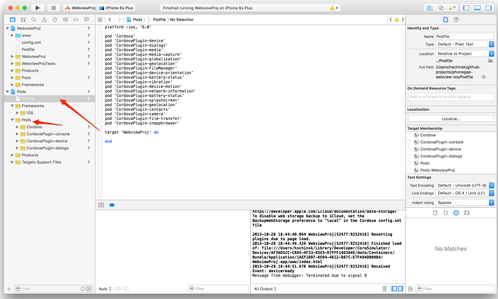

## ios-webview-www
The required resources needed for the sample iOS PhoneGap project template. Includes all the core plugins as well. 

Refer to the [Prototype for iOS Embedded Webviews Project](https://github.com/phonegap/phonegap-webview-ios) for example of using with the **CordovaLib** framework and plugins.

**THIS LINE WIlL CHANGE TO POINT TO PODSPEC IN REGISTRY**

	pod 'phonegap-hello', :path => '~/github-projects/ios-webview-www'

### Usage
####1) Add this to your native iOS project podfile (dev't)
	pod 'phonegap-hello', :path => '~/github-projects/ios-webview-www'

or 
####Add this line to native project podfile (once submitted to cocoapods site)
	pod 'phonegap-hello'
	
##### 2) Install the pods referenced in podfile, including this one from the terminal using the CocoaPods `pod` command:
	pod install
	
##### 3) Close the native Xcode project and open the newly created `.xcworkspace` project which now includes all the pods installed. 
For example - see project **Webview2.xcworkspace**

### Notes
For example, a Podfile in a native project might look like this to set it up for Cordova use:

	platform :ios, '6.0'

	pod 'Cordova’
	pod 'CordovaPlugin-device’
	pod 'CordovaPlugin-dialogs’
	pod 'CordovaPlugin-globalization’
	pod 'CordovaPlugin-geolocation’
	pod 'CordovaPlugin-device-orientation’
	pod 'CordovaPlugin-battery-status’
	pod 'CordovaPlugin-vibration’
	pod 'CordovaPlugin-device-motion’
	pod 'CordovaPlugin-network-information’
	pod 'CordovaPlugin-battery-status’
	pod 'CordovaPlugin-splashscreen’
	pod 'CordovaPlugin-geolocation’
	pod 'CordovaPlugin-contacts’
	pod 'CordovaPlugin-inappbrowser’
	pod 'CordovaPlugin-FileManager', '~> 3.0'
	pod 'CordovaPlugin-file-transfer', '~> 0.4'
	pod 'CordovaPlugin-media-capture', '~> 0.2'
	pod 'CordovaPlugin-media', '~> 0.2'

	pod 'phonegap-hello', :path => '~/github-projects/ios-webview-www'

	target ‘iOS-Webview-Proto’ do

	end

### Tips
* Be sure to change the target name to your native project name
* You may need to change the version of platform specified or specify certain versions for other plugins.
* If you update anything in the podfile where you have to run a `pod install` again, you must close the Workspace project in Xcode and open the newly generated one. 

### Embedding Cordova in a Native iOS Project
** This project assumed you have [previously installed CocoaPods](https://guides.cocoapods.org/using/getting-started.html) 

1. Create a Native Xcode Project - for example using the Single View Controller project
2. Add a `Podfile` - use the one from the sample prototype project or run `pod init` and modify it
3. Run `pod install` from command line to install the Cordova dependencies
4. Close your Xcode project 
5. Open the newly created `.xcworkspace` file created from the `pod install`
6. Use Cordova - for instance try the `CDVViewController` in your native project. Open the *Main.storyboard** file 
and change the Custom Class value from the default `ViewController` to a `CDVViewController` in the *Identity Inspector*  

7. Run the app. You should see the PhoneGap Hello world sample running with the Device Ready event firing and some messages indicating 
the device plugin is running. 

**LOGS from `pod install`**

	Analyzing dependencies
	Fetching podspec for `phonegap-hello` from `~/github-projects/ios-webview-www`
	Downloading dependencies
	Installing Cordova (3.9.1)
	Installing CordovaPlugin-FileManager (3.0.0)
	Installing CordovaPlugin-battery-status (0.2.10)
	Installing CordovaPlugin-contacts (0.2.12)
	Installing CordovaPlugin-device (0.2.11)
	Installing CordovaPlugin-device-motion (0.2.9)
	Installing CordovaPlugin-device-orientation (0.3.1)
	Installing CordovaPlugin-dialogs (0.2.9)
	Installing CordovaPlugin-geolocation (0.3.6)
	Installing CordovaPlugin-globalization (0.2.4)
	Installing CordovaPlugin-inappbrowser (0.3.0)
	Installing CordovaPlugin-media (0.2.4)
	Installing CordovaPlugin-network-information (0.2.3)
	Installing CordovaPlugin-splashscreen (0.2.5)
	Installing CordovaPlugin-vibration (0.3.3)
	Installing phonegap-hello (0.0.1)
	Generating Pods project
	Integrating client project

	[!] Please close any current Xcode sessions and use `iOS-Webview-Proto.xcworkspace` for this project from now on.
	Sending stats
	Sending stats
	Pod installation complete! There are 16 dependencies from the Podfile and 16 total pods installed.